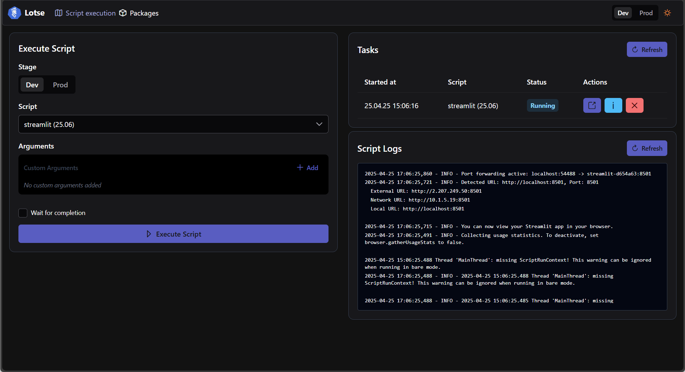
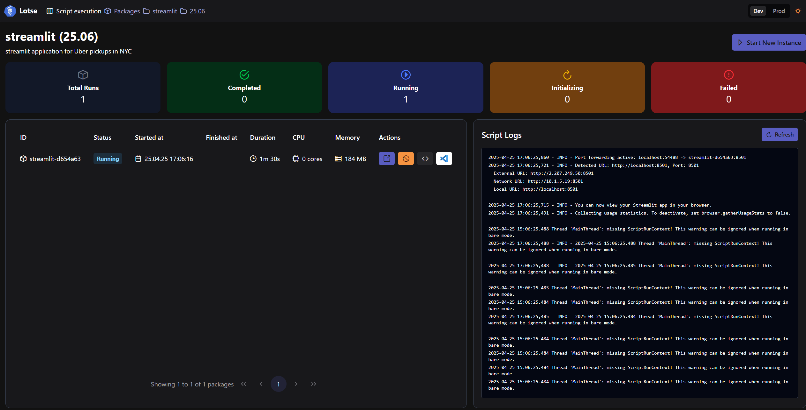

> ⚠️ **Note**: This project is in very early stages of development and not ready for production use.

# 🧭 Lotse

<p align="center">
  
</p>

## 🌟 Overview

Lotse is an advanced Function-as-a-Service (FaaS) framework that goes beyond traditional serverless computing. It enables you to deploy and execute entire Python projects, not just individual functions. Built with Kubernetes at its core, Lotse provides a robust platform for managing, deploying, and executing Python applications with sophisticated lifecycle management and development capabilities.

> **Why "Lotse"?** Lotse is the German word for "pilot" or "navigator", reflecting its role in guiding packages through the complexities of deployment and execution.

## ✨ Key Features

- 📦 **Multi-Language Support**: Deploy Python, all sort of binaries (Go, .NET etc.), and custom containers via REST endpoints or Lotse UI

- 🔄 **Advanced Container Management**: Kubernetes container provisioning with improved status monitoring and lifecycle management

- 🔧 **Cluster Management**: Complete Kubernetes cluster administration capabilities

- ⚡ **Virtual Environment Caching**: Optimized performance through venv caching mechanism for python runtime

- 💻 **IDE Integration**: On-demand VS Code server deployment for remote development

- 🖥️ **Interactive Terminal Access**: Direct terminal access to running containers

- 🔀 **Version Management**: Deploy packages in user specified versioning

- 🔌 **Proxy Support**: Automatic proxy configuration

## 📸 Screenshots





## 🚀 How It Works

1. **Project Deployment**

- Package your project (Python, Go, .NET, or custom container)

- Use the REST API or UI drag-and-drop to deploy the project

- Lotse stores information in PostgreSQL and on disk

2. **Execution**

- Request project execution via REST endpoint or UI

- Lotse spins up a Kubernetes container with improved status monitoring

- Dependencies are installed or retrieved from cache

- Project is executed with specified entry point and runtime arguments

3. **Development Features**

- Access running containers through VS Code server

- Use terminal for direct interaction

- Debug applications in real-time

## 🔧 Technical Stack

- 🐍 **Backend**: FastAPI (Python)

- 🅰️ **Frontend**: Angular

- ☸️ **Container Orchestration**: Kubernetes

- 🐘 **Database**: PostgreSQL

- 📨 **Message Queue**: ActiveMQ (for async operations)

- 🧰 **Development Tools**: VS Code

## 🏁 Getting Started

### Prerequisites

- Kubernetes command line tool (kubectl)
- Docker Desktop
- Kubernetes enabled in Docker Desktop or any other Kubernetes cluster
- Python 3.13.2
- Node.js >= 20

### Local Development Setup

```bash
# Clone the repository
git clone https://github.com/Picoba-Solutions-GmbH/lotse.git
cd lotse

# Bootstrap Kubernetes environment
./startup.ps1

# Access points after startup
# UI: http://kubernetes.docker.internal/lotse/ui
# API Docs: http://kubernetes.docker.internal/lotse/docs

# For local debugging:
# 1. Start PostgreSQL
docker-compose up -d

# 2. Configure environment
cp .env.example .env

# 3. Start backend (VS Code)
python -m venv venv
pip install -r requirements.txt
# Press F5 to start - Swagger UI opens at localhost:8000/docs

# 4. Start UI development server
cd lotse-ui
npm i
npm run start
```

## 🔐 Authentication

For demo purposes the authentication is diabled. You can enable it by setting the environment variable `ENABLE_AUTH` to `true`.

## 📁 Project Structure

```
.
├── src/                 # Core Python backend
├── lotse-ui/            # Angular frontend
├── k8s/                 # Kubernetes configurations
├── samples/             # Example projects
└── docker-compose.yml   # Local development setup
```

## 🧪 Sample Projects

The framework includes several example projects demonstrating different use cases:

- 📊 Plotly Dash

- 🖼️ Gradio

- 📈 Streamlit

- 🎨 NiceGUI

- 🐍 Hello world script

- 🌐 FastAPI web application

- ☕ Go binary with Gin framework

- 🎯 .NET Blazor binary

- 🐳 Custom container with entrypoint

## 👥 Contributing

We welcome contributions from the community! Please read our contribution guidelines before submitting a pull request.

> 🚧 **Note**: Detailed contribution guidelines coming soon!

## 📝 License

This project is licensed under the Apache License 2.0 - see the LICENSE file for details.

> 📜 For more information, visit: [Apache License 2.0](https://www.apache.org/licenses/LICENSE-2.0)

---

⭐ **Star this repo if you find it useful!**\
📣 **Issues and PRs welcome!**

_This project is under active development. Documentation will be updated as the project evolves._
