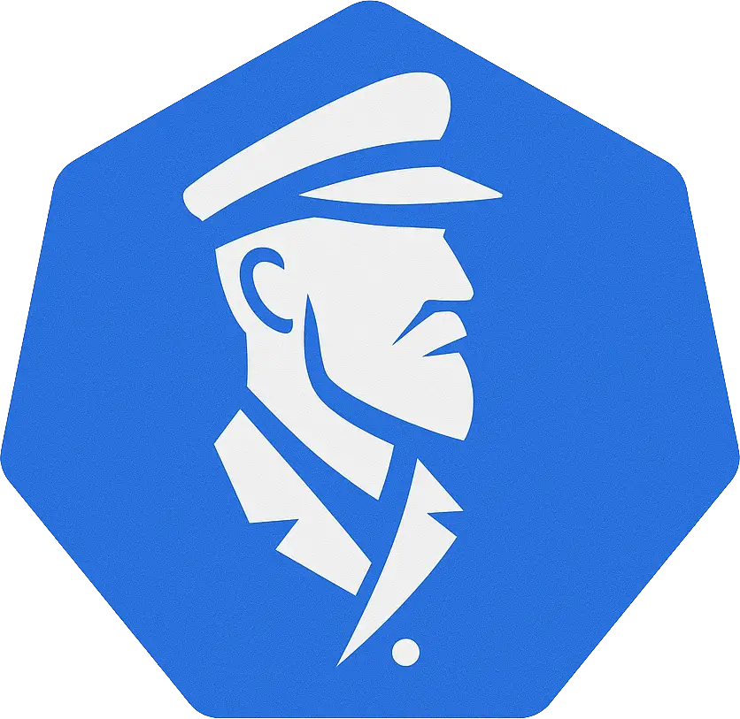

> ⚠️ **Note**: This project is in very early stages of development and not ready for production use.

# 🧭 Lotse

<p align="center">
  
</p>

## 🌟 Overview

Lotse is an advanced Function-as-a-Service (FaaS) framework that goes beyond traditional serverless computing. It enables you to deploy and execute entire Python projects, not just individual functions. Built with Kubernetes at its core, Lotse provides a robust platform for managing, deploying, and executing Python applications with sophisticated lifecycle management and development capabilities.

> **Why "Lotse"?** Lotse is the German word for "pilot" or "navigator", reflecting its role in guiding packages through the complexities of deployment and execution.

## ✨ Key Features

- 📦 **Full Project Deployment**: Deploy complete Python projects via REST endpoints

- 🔄 **Dynamic Container Management**: Automatic Kubernetes container provisioning and lifecycle management

- ⚡ **Virtual Environment Caching**: Optimized performance through venv caching mechanism

- 💻 **IDE Integration**: On-demand VS Code server deployment for remote development

- 🖥️ **Interactive Terminal Access**: Direct terminal access to running containers

- 🔀 **Multi-Stage Support**: Separate development and production environments

- 📊 **UI Dashboard**: Angular-based management interface for easy project management

- 🔌 **Proxy Support**: Automatic proxy configuration for web applications

## 📸 Screenshots


## 🔮 Roadmap & Planned Features

- 🖼️ **Custom Container**: Specify custom container images via config.yaml
- 🔧 **Binary Execution**: Support for executing compiled binaries (this would allow any type of runtime to run regardless of programming language)
- 🌐 **More Languages**: Support other programming languages:
  - C# / .NET Core
  - Go

## 🚀 How It Works

1. **Project Deployment**

- Package Python project with requirements.txt

- Use the REST API to deploy the project

- Lotse stores information in PostgreSQL and on disk

2. **Execution**

- Request project execution via REST endpoint

- Lotse spins up a Kubernetes container

- Dependencies are installed or retrieved from cache

- Project is executed with specified entry point

3. **Development Features**

- Access running containers through VS Code server

- Use terminal for direct interaction

- Debug applications in real-time

## 🔧 Technical Stack

- 🐍 **Backend**: FastAPI (Python)

- 🅰️ **Frontend**: Angular

- ☸️ **Container Orchestration**: Kubernetes

- 🐘 **Database**: PostgreSQL

- 📨 **Message Queue**: ActiveMQ (for async operations)

- 🧰 **Development Tools**: VS Code

## ⚙️ Configuration

The system supports various configuration options through environment variables and yaml files:

- Kubernetes namespace configuration

- Python version selection

- Resource limits

- Timeout settings

- Proxy configurations

- Development mode settings

## 🏁 Getting Started

### Prerequisites

- Kubernetes command line tool (kubectl)
- Docker Desktop
- Kubernetes enabled in Docker Desktop or any other Kubernetes cluster
- Python 3.13.2
- Node.js >= 20

### Local Development Setup

```bash
# Clone the repository
git clone https://github.com/Picoba-Solutions-GmbH/lotse.git
cd lotse

# Bootstrap Kubernetes environment
./startup.ps1

# Access points after startup
# UI: http://kubernetes.docker.internal/lotse/ui
# API Docs: http://kubernetes.docker.internal/lotse/docs

# For local debugging:
# 1. Start PostgreSQL
docker-compose up -d

# 2. Configure environment
cp .env.example .env

# 3. Start backend (VS Code)
python -m venv venv
pip install -r requirements.txt
# Press F5 to start - Swagger UI opens at localhost:8000/docs

# 4. Start UI development server
cd lotse-ui
npm i
npm run start
```

## 🔐 Authentication

For demo purposes the authentication is diabled. You can enable it by setting the environment variable `ENABLE_AUTH` to `true`.

## 📁 Project Structure

```
.
├── src/                 # Core Python backend
├── lotse-ui/            # Angular frontend
├── k8s/                 # Kubernetes configurations
├── samples/             # Example projects
└── docker-compose.yml   # Local development setup
```

## 🧪 Sample Projects

The framework includes several example projects demonstrating different use cases:

- 📊 Plotly Dash

- 🖼️ Gradio

- 📈 Streamlit

- 🎨 NiceGUI

- 🐍 Hello world script

## 👥 Contributing

We welcome contributions from the community! Please read our contribution guidelines before submitting a pull request.

> 🚧 **Note**: Detailed contribution guidelines coming soon!

## 📝 License

This project is licensed under the Apache License 2.0 - see the LICENSE file for details.

> 📜 For more information, visit: [Apache License 2.0](https://www.apache.org/licenses/LICENSE-2.0)

---

⭐ **Star this repo if you find it useful!**\
📣 **Issues and PRs welcome!**

_This project is under active development. Documentation will be updated as the project evolves._
