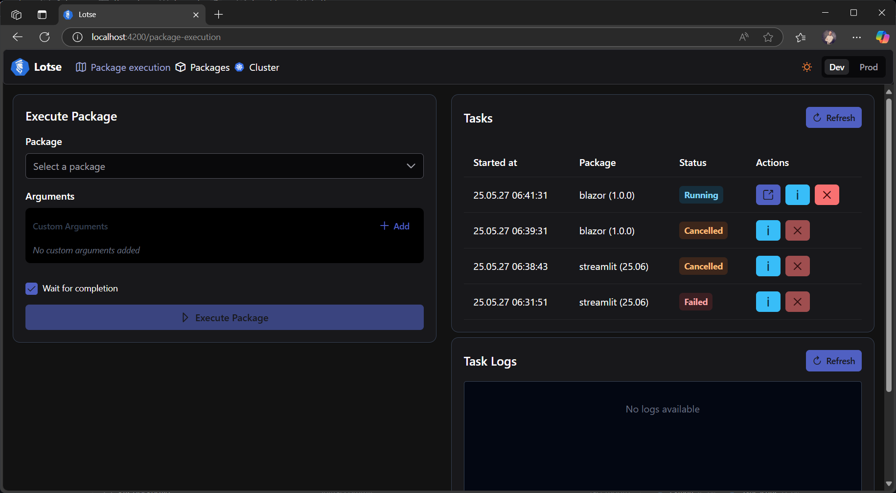
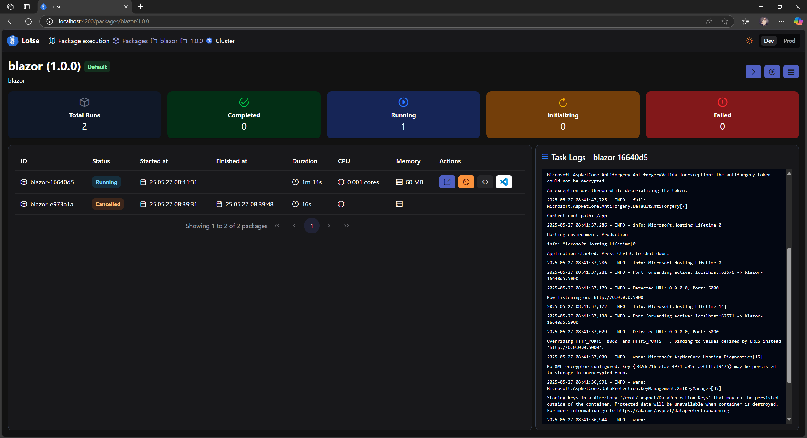
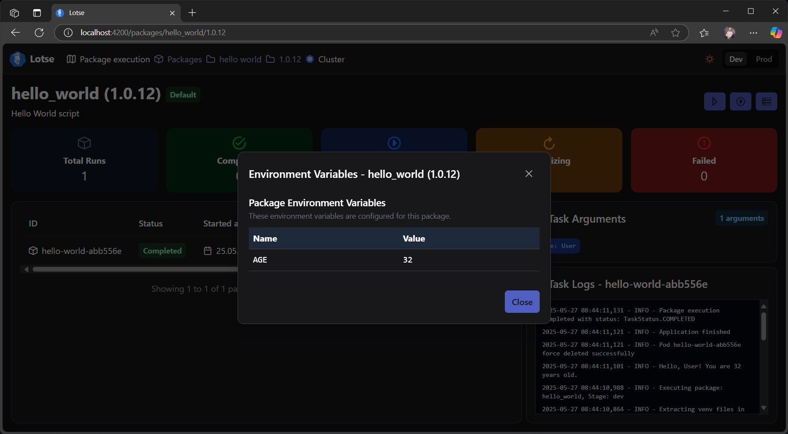
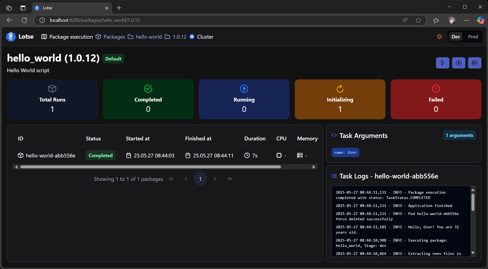
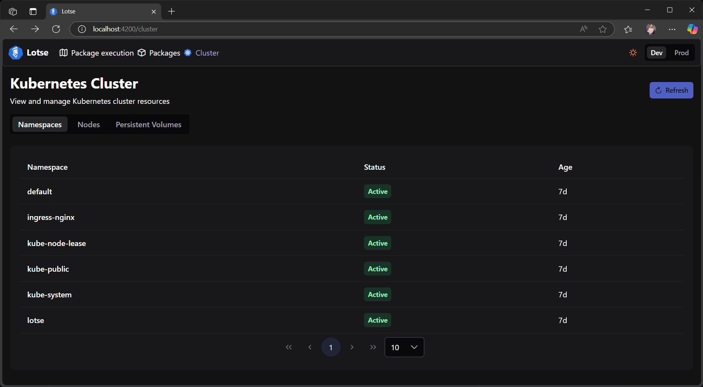
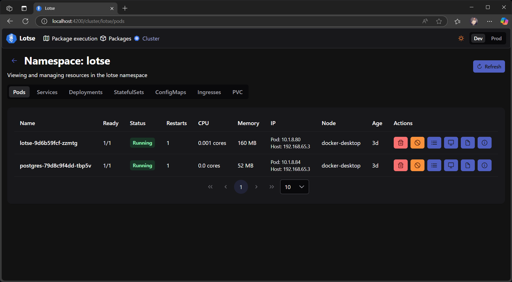
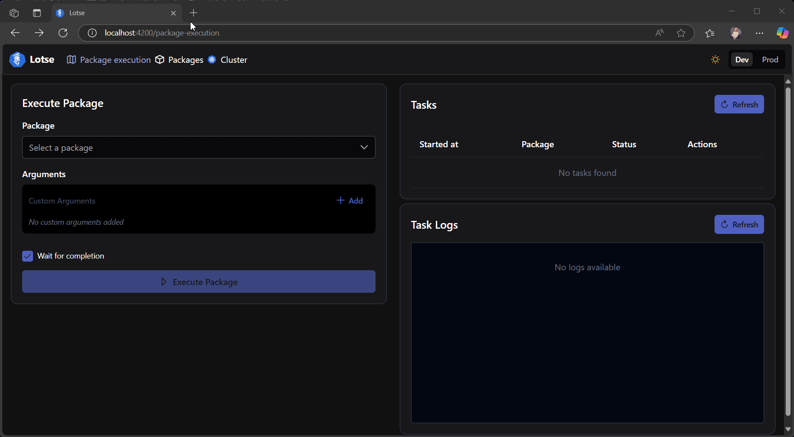
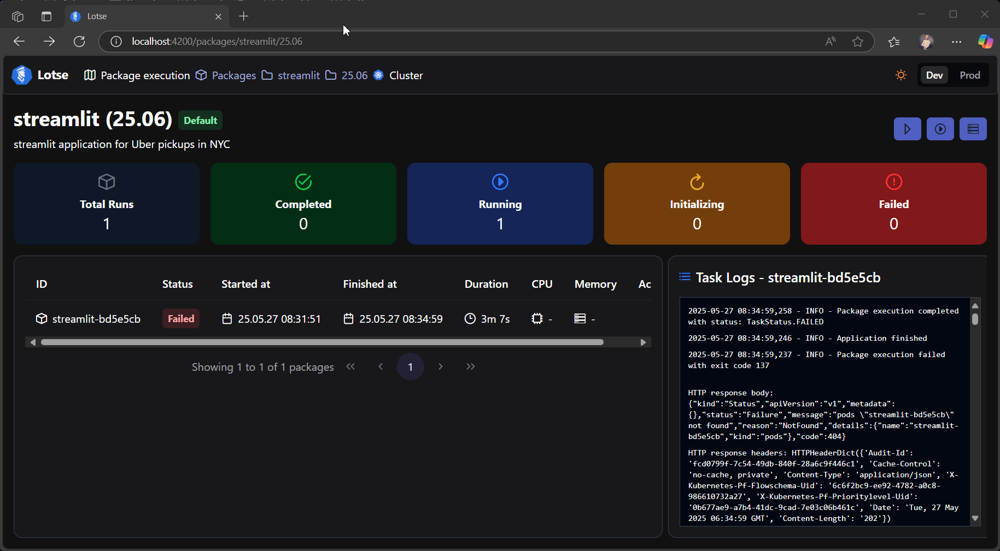
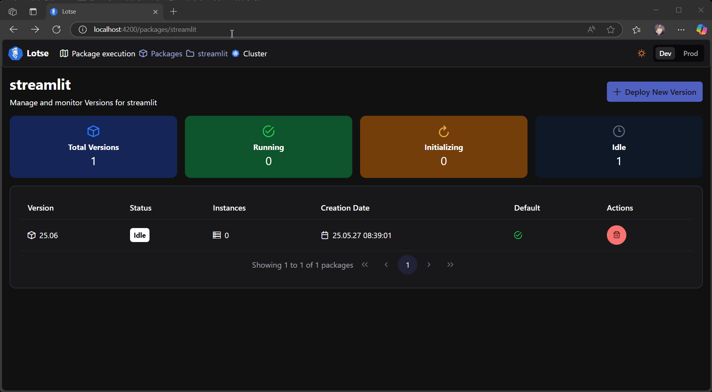
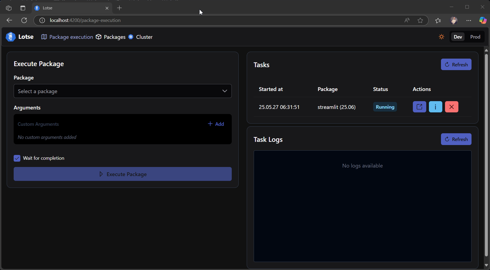

# 📸 Lotse Screenshots & Demonstrations

This document contains screenshots and animated demonstrations of the Lotse platform's features and functionality.

## Screenshots

### Application Overview

*Main overview*

### Package View

*Detailed view of a package with running instances*

*Environment variables of a package*

*Arguments of a package*

### Kubernetes Integration

*Kubernetes cluster view*

*Namespace view*

## Demonstrations

### Python Runtime

*Automatic Python environment setup and dependency installation*

*Python package cache for faster startup*

### Execution Workflows

*Demonstration of binary package execution process*

*Walkthrough of cluster UI*